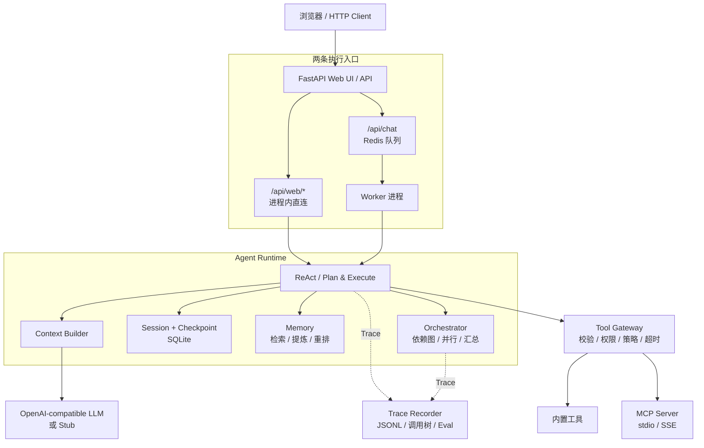
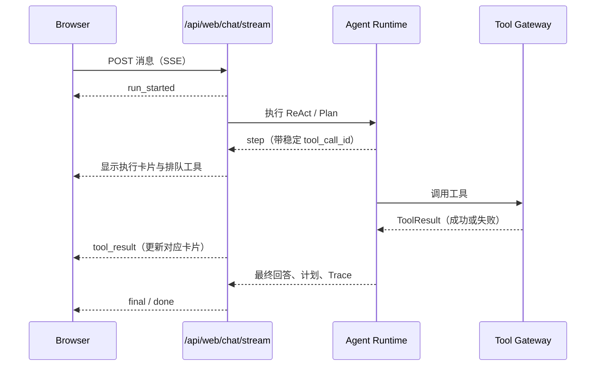

# ReAgent

一个从零实现的 Python LLM Agent 运行时。它提供 ReAct 与 Plan-and-Execute 两种执行模式、工具治理、会话与检查点、长期记忆、MCP、Skill、多 Agent 编排，以及实时展示执行过程的 Web UI。

ReAgent 使用 OpenAI-compatible 接口接入模型；没有配置模型密钥时，也可以使用内置 Stub 模型完成离线开发、演示和测试。项目不依赖 LangGraph、CrewAI 或 AutoGen 等 Agent 框架。

## 功能

| 能力 | 说明 |
| --- | --- |
| Agent 执行 | ReAct 工具循环；Plan-and-Execute 规划、执行与有限次数反思重规划。 |
| 工具治理 | Schema 校验、权限、策略、超时、重试与统一 `ToolResult` 信封。 |
| 状态与记忆 | SQLite 会话和检查点；向量检索、事实提炼与重排序。 |
| 多 Agent 编排 | 基于档案的分工、依赖图调度、并行执行、嵌套深度限制和结果持久化。 |
| MCP 与 Skill | 接入 stdio / SSE MCP Server；按触发条件加载可复用 Skill。 |
| 可观测性 | JSONL Trace、调用树、评测与回归结果。 |
| Web UI | SSE 实时展示决策、工具状态、Trace、并行编排和会话历史；支持移动端布局。 |

## 快速开始

### 前置条件

- Python 3.11 或更高版本（Docker 镜像使用 Python 3.12）
- 可选：Docker Desktop，用于 Redis、Worker 和完整 Compose 栈
- 可选：OpenAI-compatible 模型与 embedding 服务凭据

SQLite 数据文件会自动创建。仅使用 Web UI 直连模式时不需要启动 Redis 或 Worker；异步队列 API 才需要 Redis 与 Worker。

### 1. 创建虚拟环境并安装依赖

Windows PowerShell：

```powershell
py -3.11 -m venv .venv
.\.venv\Scripts\Activate.ps1
python -m pip install --upgrade pip
pip install -r requirements.txt
Copy-Item .env.example .env
```

macOS / Linux：

```bash
python3.11 -m venv .venv
source .venv/bin/activate
python -m pip install --upgrade pip
pip install -r requirements.txt
cp .env.example .env
```

不创建 `.env` 也能运行：默认 `LLM_PROVIDER=auto` 会在没有 LLM 地址和密钥时选择内置 Stub 模型。请不要提交 `.env`。

### 2. 启动 Web UI

```bash
python -m uvicorn app.main:app --host 127.0.0.1 --port 8000
```

访问 [http://127.0.0.1:8000](http://127.0.0.1:8000)。Web UI 会进程内调用 Agent 运行时，实时显示工具调用、成功/失败状态、Trace 和编排结果。

健康检查：

```bash
curl http://127.0.0.1:8000/health
```

### 3. 配置真实模型（可选）

在 `.env` 中填写一个 OpenAI-compatible 聊天接口：

```env
LLM_PROVIDER=openai
LLM_BASE_URL=https://your-provider.example/v1
LLM_API_KEY=replace-me
LLM_MODEL=your-chat-model
```

启用长期记忆时，额外配置 embedding：

```env
MEMORY_ENABLED=true
EMBEDDING_PROVIDER=openai
EMBEDDING_BASE_URL=https://your-provider.example/v1
EMBEDDING_API_KEY=replace-me
EMBEDDING_MODEL=your-embedding-model
```

完整的可选配置（MCP、天气、SMTP、工具策略、Trace 等）见 [.env.example](.env.example)。

也可以在 Web UI 的 **Settings** 中修改聊天模型、Embedding、Tavily / GitHub 密钥和多 Agent 编排参数。密钥输入为只写字段，读取接口只返回“是否已配置”；保存值写入 `RUNTIME_CONFIG_FILE`，重启 API 与 Worker 后生效。

## 架构



`/api/web/*` 面向交互式页面：请求在 API 进程内执行，并可通过 SSE 返回过程事件。`/api/chat` 面向异步任务：Gateway 只负责入队，Worker 执行 Agent，因此可按需横向扩展。

### Web UI 的实时执行流程



## 使用方式

### Web UI 同步请求

```bash
curl -X POST http://127.0.0.1:8000/api/web/chat \
  -H "Content-Type: application/json" \
  -d '{"message":"计算 123 * 456","agent_mode":"react"}'
```

常用端点：

| 端点 | 用途 |
| --- | --- |
| `GET /` | Web UI。 |
| `GET /health` | 健康检查。 |
| `POST /api/web/chat` | 同步运行 Agent，返回回答、工具调用、计划和 Trace。 |
| `POST /api/web/chat/stream` | SSE 流式运行 Agent。 |
| `GET /api/web/sessions` | 查看 Web UI 会话。 |
| `POST /api/web/orchestrate` | 运行多 Agent 编排。 |
| `GET /api/web/settings` | 查看可公开的运行配置与子 Agent 启用状态（不回显密钥）。 |
| `PATCH /api/web/settings` | 保存模型、密钥与编排配置，重启后生效。 |
| `POST /api/chat` | 将任务写入 Redis 队列，返回 `job_id`。 |
| `GET /api/jobs/{job_id}` | 查询异步任务状态。 |
| `GET /api/traces/{trace_id}` | 查询 Trace 调用树。 |

更多 Web UI 管理接口（Agent 档案、MCP、Skill、文件和编排历史）定义在 [app/api/web.py](app/api/web.py)。

### 使用 Docker Compose 启动完整栈

```bash
docker compose up --build
```

该命令启动 API、Redis 与 Worker。扩展 Worker 数量：

```bash
docker compose up --scale worker=3
```

Compose 会在存在时读取根目录 `.env`，并将 SQLite、Trace、Settings 覆盖和自定义子 Agent 档案写入名为 `agent_data` 的 Docker volume。

服务器执行 `git pull` 只会更新宿主机源码，不会替换正在运行的容器。更新后请重建并重启：

```bash
docker compose up -d --build --force-recreate
docker compose exec api python -c "from app.config import get_settings; s=get_settings(); print(s.agent_version, s.orchestrator_enabled, s.agent_profiles_file)"
curl http://127.0.0.1:8000/api/web/agents
```

最后一个接口默认应返回 4 个内置档案；若 `enabled=false`，在 Settings 中启用编排并重启服务。自定义档案现在固定保存到 `/data/agent_profiles.json`，重建容器不会再丢失。

## 项目结构

```text
ReAgent/
├── app/
│   ├── agent/          # ReAct、规划、运行时、上下文与状态
│   ├── api/            # FastAPI Gateway 与 Web UI 路由
│   ├── checkpoint/     # SQLite 检查点
│   ├── llm/            # OpenAI-compatible 与 Stub 客户端
│   ├── mcp/            # MCP client 与 bridge
│   ├── memory/         # 向量记忆、提炼和重排序
│   ├── orchestrator/   # 多 Agent 规划、调度和持久化
│   ├── queue/          # Redis 队列与任务模型
│   ├── session/        # 会话持久化
│   ├── skills/         # Skill 加载与匹配
│   ├── static/         # Web UI 前端资源
│   ├── tools/          # 工具注册、Gateway、Policy 与内置工具
│   ├── tracing/        # Span、Trace Recorder 与上下文传播
│   └── main.py         # 应用入口
├── demos/              # 可运行示例
├── docs/               # 阶段说明、演示与设计文档
├── evals/              # 评测数据、评测器与回归结果
├── skills/             # 项目级 Skill 定义
├── tests/              # 离线 pytest 测试
├── docker-compose.yml  # API、Redis、Worker 编排
└── requirements.txt
```

## 开发与测试

运行完整离线测试：

```bash
python -m pytest -q
```

运行示例：

```bash
python -m demos.stage1_demo
python -m demos.stage4_demo  # 需要 Redis
```

运行评测与对比：

```bash
python -m evals.runner
python -m evals.runner --compare evals/runs/<baseline>.json
```

## 安全与运行边界

- 密钥、服务地址和邮箱授权码只通过环境变量提供；`.env` 已被 Git 忽略。
- 内置计算与代码运行工具使用 AST 白名单，避免直接 `eval()`、`exec()` 或 `shell=True`。
- 工具调用经过参数校验、策略、权限、超时与重试控制；MCP 工具应按最小权限配置。
- Trace 默认不记录完整 Prompt、认证信息或敏感工具参数。生产环境仍应结合网络隔离、凭据轮换、访问控制和审计策略使用。

## 文档与贡献

- [阶段 1：ReAct Loop](docs/stage1.md)
- [阶段 12：多 Agent 编排](docs/stage12.md)
- [前端审查与实施计划](docs/frontend-audit-plan.md)
- [UI 与底层改进记录](docs/ui-runtime-improvements-2026-09-12.md)
- [MARL 科研助手演进规划（尚未实施）](docs/marl-research-assistant-roadmap.md)
- [演示录制指南](docs/demo-guide.md)

提交改动前请运行测试，并避免提交 `.env`、数据库、Trace、评测运行结果或其他运行时生成文件。当前仓库未声明许可证；在复用或分发前请先确认许可范围。
