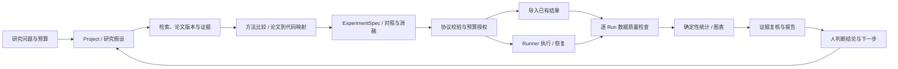
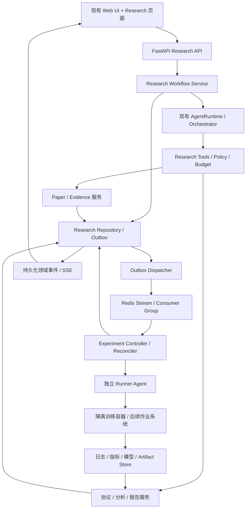

# ReAgent 强化学习科研助手：详细改进与实施计划

编写日期：2026-09-20

代码基线：`78a1848`（Redis Stream 迁移已合入 main）

文档状态：分阶段实施中。第 18 节的首个 M0/R01 切片已实现项目、资料快照、论文版本、证据、待核验主张与报告 API；M1 已把这些能力接入 Web Agent 的 18 个项目工具，并交付结构化 arXiv 搜索、精确版本摘要、受控 PDF 快照、持久查询/混合检索、比较 CSV/BibTeX、Library/Evidence Inspector 最小界面、fixed 10/30 工程门槛和一个通过的 DeepSeek 非 PPO 真实任务。使用方式和验收范围见 [科研基础说明](rl-research-foundation.md)。实验协议、统计与训练模块仍是后续设计，不能视为已交付能力。

产品方向是 **通用 Agent + 可复用的强化学习科研能力**。用户选择的 **PPO 单智能体复现与实验分析** 仅是首个验收样例，不是产品定位或后续研究范围。当前样例只包含公开论文元数据、摘要短摘录与合成指标，训练、实验协议管理和统计分析尚未执行或实现。

适用对象：希望用 ReAgent 支持强化学习文献调研、论文复现、实验设计、训练管理、结果分析与报告整理的个人研究者或小型课题组。

本文承接 [MARL 科研助手演进规划](marl-research-assistant-roadmap.md)，将范围扩展为通用 RL 科研，并把原有方向细化为可拆分的开发任务。工程入口以本计划为准，旧文档保留为背景；涉及队列的现有设计另见 [Redis Stream 迁移计划](redis-stream-queue-migration-plan.md)。

快速导航：[现状与缺口](#current-capabilities) · [架构与数据模型](#target-architecture) · [实验与队列可靠性](#experiment-reliability) · [分阶段实施](#implementation-roadmap) · [工作包拆分](#delivery-packages) · [下一步](#next-implementation)。

## 1. 建议的产品定位与首个目标

**把 ReAgent 建设为“围绕研究项目保存证据、组织实验并辅助判断的科研工作台”。**

保留现有通用 Agent 的对话、规划、工具调用与任务执行能力。科研扩展应让 Agent 根据用户问题组合文献检索、代码理解、实验设计、结果分析和报告工具；公共数据模型和流程不绑定某个算法。具体算法、环境与执行框架作为项目数据或适配器输入，不将“PPO 复现”设为所有任务的默认目标。

建设重点是让用户能够回答：

1. 这个研究结论来自哪篇论文的哪个版本、哪一页，还是来自我的实验？
2. 这次复现到底用了什么代码、环境、配置、seed、计算预算和评估协议？
3. 两组结果能否公平比较？差异是否可能来自评估口径或随机性？
4. 下一步实验为什么值得做，能排除哪个解释，预计消耗多少资源？
5. 中断、重启、重复提交或 Worker 接管后，实验记录和计算任务是否仍然对应？

建议按三个版本交付：

| 版本 | 用户可完成的完整任务 | 交付界限 |
| --- | --- | --- |
| v0.1：证据与分析助手 | 建项目 → 收集论文 → 定位证据 → 设计协议 → 导入已有实验 → 输出可核对的报告 | 不依赖训练服务，CPU 工作站即可验证主要能力 |
| v0.2：实验执行助手 | 在 v0.1 上增加受控代码变更、实验提交、取消、恢复、产物归档 | 接通一种训练后端，完成真实故障恢复验收 |
| v0.3：MARL 专项助手 | 对多智能体环境、CTDE、策略共享、评估对手和跨任务泛化建立专用工作流 | 接通一个 MARL 基线与一个环境系列，完成最小复现 |

### 1.1 默认假设与范围

- 默认由一名开发者推进，用户参与研究题目、实验协议和结论审查；工作量估算不包含等待正式训练完成的时间。
- 默认先支持本地单用户工作台；远程训练优先通过 Linux/Docker 执行端接入，保留 Windows 上的文档、配置和结果分析能力。
- 默认第一条验证链为 **PPO + Gymnasium 经典控制任务**，用于验证工程闭环，不作为科研创新或算法优越性的证明。
- 首个端到端验收任务采用“复现一个已发表结果，再验证一个单因素假设”。每个项目分别确定研究问题、环境、基线和规模；纯文献调研、方法比较和已有结果分析也应能独立完成。
- 如果用户已有 MARL 数据和论文，v0.1 直接使用这些材料；单智能体 CPU 冒烟仍可作为执行器的低成本工程验收。
- 本计划中的“Agent”主要指科研流程中的 LLM 助手；RL policy 指环境中的受训练策略，两者具有不同的状态、指标与评测。
- Offline RL、机器人实机、LLM 后训练和自动训练 ReAgent 自身，作为后续专题扩展，不纳入首个版本。

### 1.2 首个可演示场景

示例研究问题：**在预先固定的 PPO 实现和训练预算下，某项观测预处理是否影响学习表现与稳定性？**

用户提供论文、代码仓库和已有训练结果后，助手应：

1. 建立 Project，固定问题、任务、预算和待检验假设。
2. 导入 3–5 篇论文，保存版本、来源、全文读取范围和关键证据。
3. 对照论文与代码形成方法卡，标出“论文写明”“代码推断”“待确认”。
4. 生成两组只改变目标因素的协议；其余配置固定，调参预算单独记录。
5. 导入每组多个独立训练 seed 的结果，检查评估环境、指标、步数与缺失数据。
6. 生成逐 seed 表、学习曲线、差异区间、局限与后续实验建议。
7. 报告中的每个关键数值能追溯到原始记录，每条文献结论能定位到证据。

v0.1 用已有文件完成此场景；v0.2 才让工作台实际启动训练。结果没有显著提升也属于有效科研交付。

### 1.3 通用性约束与验收

- Project、PaperVersion、Evidence、Claim、ExperimentSpec 和报告不写死算法名称、环境名称或训练框架。
- Agent 从用户任务确定目标并选择工具；用户只要求调研或分析时，不自动改写成训练或复现任务。
- 方法卡与实验协议使用公共字段，算法特定参数、校验规则及执行命令通过可扩展配置或适配器表达。
- 验收至少覆盖：一个不涉及训练的文献比较任务、一个非 PPO 的资料与实验协议任务、一个由用户提供结果的分析任务。PPO Demo 成功不能单独证明通用科研能力已经完成。
- 当前交付包含数据与证据 API，以及 Web Agent 工具接入；脚本验收只证明工程链路，真实模型自主研究质量尚未评测。后续逐步扩展文献、协议、分析和训练模块。

<a id="current-capabilities"></a>

## 2. 当前代码基础与真实缺口

以下为基线源码静态核对结果。上一轮交付记录为 `405 passed, 3 skipped`，属于通用工程回归结果；本次文档编写未重跑，也不把该数字作为科研能力指标。

| 领域 | 当前已有基础与代码入口 | 需要新增或改造 |
| --- | --- | --- |
| LLM 执行 | [AgentRuntime](../app/agent/runtime.py)，ReAct、Plan-and-Execute、会话与检查点 | 可长期恢复的科研任务状态、阶段产物与验收门槛 |
| 文献检索 | 兼容 arXiv 入口及项目化结构搜索、版本导入、查询历史与混合检索 | 批量导入、PDF 页段索引、比较矩阵、BibTeX 导出与专用 Library UI |
| PDF 阅读 | [documents.py](../app/tools/builtin/documents.py) 可按页读取本地 PDF，输出有长度限制 | 页/段落级索引、读取覆盖记录、表格/公式证据定位与提取质量提示 |
| 通用统计 | [analyze.py](../app/tools/builtin/analyze.py) 支持 CSV/JSON 分组与行级统计 | RL 结果 Schema、seed 层级、预算对齐、区间估计、缺失/失败运行处理 |
| 多 Agent | [profiles.py](../app/orchestrator/profiles.py)、[runner.py](../app/orchestrator/runner.py) 已有角色白名单和依赖调度 | 科研输出契约、工件引用、独立审查、持久化等待；当前依赖上下文主要拼接答案文本 |
| 工具治理 | [gateway.py](../app/tools/gateway.py)、[policy.py](../app/tools/policy.py) 有校验、权限和确认决策类型 | 真实审批记录、预算授权、恢复入口；当前策略文件明确说明没有交互式人工确认通道 |
| 异步队列 | [producer.py](../app/queue/producer.py) 已有 Stream、ACK、PEL、claim、attempt/终态保护 | 长任务租约隔离、训练端幂等、持久记录与消息一致性、真实 Redis 故障测试 |
| 前端执行 | [execution/models.py](../app/execution/models.py)、[web.py](../app/api/web.py) 有执行记录、SSE、回放、取消 | Project、Paper、Experiment、TrainingRun、比较与证据面板；Web 执行取消不等同于取消外部训练 |
| 记忆 | [memory/](../app/memory/) 有 SQLite 向量检索与事实提炼 | 按项目隔离，区分原始来源、确认结论和临时推断，保留失效/更新关系 |
| 评测 | [evals/](../evals/) 有通用任务与回归框架 | 科研任务集、统计陷阱集、引用核验、专家标注、成本与质量联合评价 |
| 训练执行 | [code_exec.py](../app/tools/builtin/code_exec.py) 为受限通用代码工具 | 独立训练 Runner、进程/容器/作业句柄、资源限额、checkpoint 恢复协议 |

工程原则：延用现有 FastAPI、Pydantic、SQLite、Redis 和工具框架。先新增清晰的科研业务模块，避免同时改写整个 Agent 引擎、替换前端框架或引入训练集群。

## 3. 目标研究工作流



### 3.1 文献调研

输出：`literature_review.md`、`comparison.csv`、`references.bib`、证据记录。

- 支持按问题、论文 ID、DOI、用户上传 PDF 和代码仓库建立资料集。
- 记录检索式、时间、来源、分页与错误，区分“无结果”“接口失败”“只有摘要”。
- 比较表优先采用领域维度：任务假设、输入信息、动作空间、训练目标、样本效率、基线、评估协议、适用限制。
- 涉及“最新”“最优”“首次提出”的陈述必须有检索范围和时间；不凭未检索到反例就确认创新。

### 3.2 论文复现

输出：`reproduction_checklist.md`、配置快照、论文与实现差异表。

- 核对论文版本、仓库 commit、依赖、环境版本、训练与评估代码入口。
- 建立“论文公式/算法步骤 → 源文件/函数/行号 → 配置参数 → 测试”的映射。
- 将复现状态细分为：安装成功、冒烟通过、训练完成、指标可比、支持论文结论；每级保存证据。
- 缺少作者实现或关键超参数时，明确区分忠实复现与合理重实现。

### 3.3 假设与实验设计

输出：版本化 ExperimentSpec、对照/消融矩阵、预算估算。

- 每个假设记录动机证据、待改变因素、预期观察、反证条件、混杂变量和停止条件。
- 允许提出方法改进，但将其标为候选假设；创新性由检索和实验逐步支持。
- 预先固定主指标、checkpoint 选择规则、调参预算、测试划分和失败处理规则。
- 多因素研究需要显式设计因子组合，不能把多个改动带来的收益全部归因于其中一个。

### 3.4 实验诊断与写作

输出：问题清单、证据支持的诊断、图表、结果报告与可移交复现包。

- 建立 NaN/Inf、梯度异常、KL/熵变化、回报与 episode 长度异常的规则提示。
- 指标变化只能触发候选诊断，例如 KL 上升不直接等于某个实现 bug。
- 先给出原始证据、可能解释与验证动作，再建议修改；不在正式运行中静默改变配置。
- 报告区分外部论文结果、本项目复现结果、探索性结果和未来假设。

<a id="target-architecture"></a>

## 4. 目标架构与复用边界



### 4.1 分清四种状态

| 状态类型 | 负责什么 | 推荐事实来源 |
| --- | --- | --- |
| Agent Execution | 一次对话或分析任务是否完成 | 现有 ExecutionRecord |
| Research Workflow | 调研、设计、分析、审查的阶段进度 | 新增 Workflow/Step 记录 |
| Queue Delivery | 某条控制命令是否已被可靠处理 | Redis Stream 与处理回执 |
| TrainingRun | 训练是否存在、运行、失败、取消、完成 | Research 数据库 + Runner 作业事实 |

LLM 调用结束、队列 ACK、浏览器断线、训练退出是不同事件。前端应分别显示，不能互相推断。

### 4.2 部署与存储选择

- v0.1：在现有 SQLite 部署上增加有版本的数据库迁移；科研元数据以关系表保存，向量索引是派生数据。
- 大文件放项目产物目录，数据库保存 artifact_id、URI、大小、hash、创建来源。避免将 PDF、曲线明细和 checkpoint 放入 Redis 消息。
- v0.2：训练依赖放独立环境或镜像，不把 PyTorch、环境库、RL 框架塞进 API 基础依赖。
- 单节点先由服务端访问 SQLite；远程 Runner 经 API 回传，不挂载共享 SQLite 文件。多主机服务或明显写锁竞争出现后，再迁移 PostgreSQL。
- 文件产物先写临时路径并校验 hash，再发布清单；出现数据库/文件半完成状态时靠对账修复，不宣称跨介质原子提交。
- 项目增大后再接对象存储；不把对象存储、向量数据库、Kubernetes 同时设为首版前提。

## 5. 科研数据模型与一致性约定

### 5.1 核心实体

| 实体 | 必要字段 | 关键约束 |
| --- | --- | --- |
| ResearchProject | project_id、title、question、scope、owner、budget_policy、status | 所有资料、运行与结论有项目归属 |
| Paper / PaperVersion | paper_id、source_id、version、title、authors、URL、published_at、fetched_at、file_hash | 论文身份与版本分离；来源失效不删除历史证据 |
| EvidenceSpan | evidence_id、paper_version_id、page、section、locator、text_hash、extraction_method | 可重新定位；PDF 物理页与印刷页码分别保存 |
| Claim | claim_id、text、kind、verification_status、scope、created_by | 明确事实、推断、假设；不能用高置信分数代替核验 |
| ClaimEvidence | claim_id、evidence_id、relation、reviewer、reviewed_at | 支持/反驳/背景为多对多关系 |
| Hypothesis | hypothesis_id、rationale_claims、factor、expected_effect、falsification_rule | 与具体实验设计关联，保留否定与修订记录 |
| ExperimentSpec | experiment_id、revision、hypothesis_id、config、code_ref、protocol、spec_hash | 已使用版本不可变；修改产生新 revision |
| TrainingRun | training_run_id、spec_revision、condition_id、train_seed、replicate_id、status | 一个独立训练重复对应一个逻辑 Run |
| RunAttempt | attempt_id、training_run_id、attempt_index、runner_handle、lease_epoch、resume_from | 故障恢复不是新增独立 seed；与父 Run 分开 |
| EvaluationRecord | run_id、checkpoint_hash、eval_protocol_hash、eval_episode_id、eval_seed、metric、value | 保留训练 seed 与评估 seed 的层级 |
| Artifact | artifact_id、project_id、kind、URI、sha256、size、provenance、retention | 原始输入不可覆盖；派生内容可重建 |
| Analysis / Report | analysis_id、input_hashes、analysis_spec、code_version、outputs、claim_refs | 图表、数值、文本均能追踪到输入与分析规则 |
| Approval | approval_id、actor、action、target_hash、limits、expires_at、revoked_at | 授权绑定具体内容与限额；更改配置后重新校验 |
| WorkflowStep / DomainEvent | workflow_id、step_id、input_refs、output_refs、status、seq | 支持暂停、恢复、失败依赖与有序回放 |

### 5.2 ID、版本与幂等

- 明确区分 `execution_id`、`orchestration_run_id`、`training_run_id`、`attempt_id`、Stream message ID 和外部 job handle。
- 业务去重键建议为 `(project_id, experiment_id, spec_revision, condition_id, train_seed, replicate_id)`，数据库唯一约束兜底。
- 用户有意重复一次相同 seed 的训练时必须增加 replicate_id；是否可视作独立重复由分析协议决定，不能仅凭 ID 不同判断。
- spec_hash 对规范化配置计算，覆盖代码 SHA/补丁、环境锁、数据 hash、评估协议；不要把临时路径、展示标题或密钥混入科研指纹。
- API 的 Idempotency-Key 绑定请求摘要；同 key 不同 payload 返回冲突，不能悄悄复用另一份协议。
- 重要状态修改使用 revision/CAS；终态修正使用新的审计事件，不能直接修改历史报告使其“看起来一直正确”。

### 5.3 ExperimentSpec 示例

下列 YAML 是未来 Schema 的设计样例，并非当前可执行配置。示例数字仅用于工程演示；正式训练预算应由一次短程测量和研究目标决定。

```yaml
schema_version: 1
project_id: rl-demo
experiment_id: ppo-observation-study
revision: 1
hypothesis_id: h-observation-01
mode: online_rl
backend: sb3
code:
  repository: "<选定的受控训练仓库>"
  commit: "<固定提交 SHA>"
  patch_sha256: null
  dependency_lock_sha256: "<锁文件 hash>"
environment:
  api: gymnasium
  id: CartPole-v1
  package_version: "<经过验证的版本>"
  wrappers: []
algorithm:
  name: PPO
  config_artifact: ppo-base-config
conditions:
  - id: baseline
    normalize_observations: false
  - id: treatment
    normalize_observations: true
training:
  seeds: [0, 1, 2, 3, 4]
  total_env_steps: 100000
  step_unit: individual_env_transition
evaluation:
  interval_env_steps: 10000
  episodes_per_checkpoint: 20
  seed_set_artifact: heldout-evaluation-seeds
  policy_mode: deterministic
  checkpoint_selection: final_at_fixed_budget
  observation_stats: frozen_from_training
  report_reward: raw_environment_reward
analysis:
  primary_metric: evaluation_return
  aggregation_unit: independent_training_run
  comparison_budget: 100000
resources:
  max_concurrent_runs: 1
  gpu_count: 0
  walltime_minutes_per_run: 30
  output_gib_per_run: 1
approval:
  required_for: submit_training
```

该示例的 5 个 seed 是初步实验批次，不是“足够显著”的保证；CartPole 中观察到的差异也不能外推到连续控制或 MARL。若后端不支持某字段，校验阶段报错，不允许静默忽略。

## 6. 文献、证据与知识管理

### 6.1 文献管线

1. **检索**：保留现有 arXiv 工具的兼容入口，新增结构化论文结果；对外服务配置限流、缓存、超时与可解释错误。
2. **归一化**：规范 arXiv 基础 ID/版本、DOI 和 canonical URL；标题相似只作为去重线索，不能自动合并不同工作。
3. **获取**：导入用户 PDF，或从可访问来源下载全文；保存获取时间、响应元信息和原始 hash。
4. **解析**：提取页、章节、段落；表格保留表号、标题、单元格与脚注；公式保留原始定位及人工修订记录。
5. **索引**：先用 SQLite 全文检索与现有向量能力构建混合检索；切块保留 paper_version_id 与页范围。
6. **证据核验**：对候选 Claim 建立证据链接，检查摘录是否支持该范围下的陈述。
7. **版本更新**：新增版本后提示哪些旧 Claim 需要复核，不自动覆盖原文引用。

arXiv 查询与记录字段以其 [官方 API 手册](https://github.com/arXiv/arxiv-docs/blob/develop/source/help/api/user-manual.md) 为依据；应用层仍需实现分页、缓存和版本归一化。

### 6.2 避免“检索到了”变成“已经读过”

PaperVersion 保存 `read_scope`：metadata、abstract、selected_pages、full_text，以及实际已读取的页/段集合。报告展示该范围。

- 索引完整 PDF 不等于模型读完全文；摘要总结不能声明已经核对实验表格。
- 扫描件、公式或表格解析失败时，标为 needs_review；MVP 不承诺自动正确解析任意论文。
- EvidenceSpan 的文本被截断时明确标记；引用不能包含模型补写的原文。
- 字符串匹配只能证明文本出现过；关键比较、因果和适用范围仍需语义审查。

### 6.3 科研记忆分层

| 层次 | 内容 | 更新策略 |
| --- | --- | --- |
| 原始证据 | PDF、代码、实验原始数据 | 不可变，按 hash 版本化 |
| 项目事实 | 已确认环境、协议、结论及限制 | 引用来源，带核验人和适用范围 |
| 工作假设 | 待验证想法、排查方向、临时摘要 | 可修改，禁止自动升级为事实 |
| 用户偏好 | 图表样式、常用环境、报告语言 | 与科学事实分离，可撤销 |

所有检索先过滤 project_id 和权限，再排序；禁止仅靠 Prompt 要求模型“不要看到其他项目”。论文与网页文本按不可信资料处理，不能使检索角色获得训练或系统操作权限。

## 7. RL 领域协议与方法检查

### 7.1 必须结构化的领域字段

| 维度 | 应记录/校验的内容 |
| --- | --- |
| 问题定义 | MDP/POMDP、在线/离线、离散/连续动作、episode horizon、观测与动作空间 |
| 学习设置 | on-policy/off-policy、rollout 长度、batch/minibatch、梯度步数、replay、更新比率 |
| 回报处理 | reward scaling/clipping/shaping、discount、GAE 参数、训练与报告指标的差别 |
| 环境语义 | reset/step、terminated/truncated、vector env 自动 reset、终止 observation、wrapper 顺序 |
| 评估 | 独立评估环境、策略是否随机、episode 数、评估 seed、checkpoint 选择与停止规则 |
| 公平性 | 环境步数、优化步数、wall clock、硬件、调参搜索预算、信息可见性和网络规模 |
| 可复现性 | 仓库 SHA、补丁、依赖锁、环境资产版本、数据 hash、设备、随机数状态和已知非确定性 |

终止与截断会影响 bootstrap，必须在适配器契约中区分，具体处理遵循算法与环境定义。参见 [Gymnasium 时间限制说明](https://gymnasium.farama.org/tutorials/gymnasium_basics/handling_time_limits/)。

评估应单独检查环境与 wrapper，并记录多个独立训练运行。参见 [SB3 实验与评估建议](https://stable-baselines3.readthedocs.io/en/master/guide/rl_tips.html)。本计划据此增加协议校验，不承诺某个固定 seed 数适合所有问题。

### 7.2 检查器分工

- **确定性规则**：字段缺失、seed 重复、动作空间不兼容、训练/评估奖励口径不同、预算超限、文件缺失。
- **代码测试**：终止 bootstrap、mask、张量 shape、checkpoint 读取、评估环境独立性。
- **模型辅助检查**：论文实现差异、潜在信息泄漏、合理但未覆盖的混杂因素；输出疑点与代码证据。
- **研究者判断**：创新性、研究意义、实验充分性、结果是否支持推广到更广任务。

构建 RL 方法卡模板，至少包含研究问题、目标函数、伪代码、观测假设、训练/推理差异、关键超参数、复杂度、失败模式和复现入口。

### 7.3 MARL 专用扩展

在上述协议上增加：

- 合作/竞争/混合任务，个体奖励与团队奖励的关系。
- centralized training / decentralized execution 的信息约束：critic 的全局信息不能泄漏到执行阶段 actor。
- 智能体数量、身份、动态增减、死亡 mask、可行动作 mask、参数共享、RNN 状态和通信预算。
- simultaneous / turn-based 动作时序；环境 step、联合 step、agent transition 三种计数明确区分。
- self-play 对手版本、训练/评估对手分布、cross-play 矩阵；适用时才报告 exploitability 等专用指标。
- 泛化任务的地图、初始分布、队友/对手和 agent 数量划分，避免训练测试混用。

PettingZoo 的 AEC 与 Parallel API 对应不同动作时序，转换也存在条件，适配器应分别验证。[官方 API 说明](https://pettingzoo.farama.org/)、[Parallel API](https://pettingzoo.farama.org/api/parallel/)。

v0.3 可先评估 [MPE2](https://mpe2.farama.org/) 的小规模协作任务作为接口验收，再选择 [MAPPO 官方实现](https://github.com/marlbenchmark/on-policy) 或 [SMACv2](https://github.com/oxwhirl/smacv2) 对应的复现路线。选型前做兼容性 spike，不能假设这些仓库的环境接口可直接互换；也不沿用已迁移的旧环境导入路径。

## 8. 科研角色、结构化协作与代码辅助

### 8.1 角色建议

| 角色 | 输入 → 输出 | 默认工具范围 |
| --- | --- | --- |
| Research Coordinator | 研究问题 → 工作流、阶段目标、待决策事项 | 项目读写、编排、预算查询 |
| Literature Researcher | 问题/论文集合 → PaperVersion、EvidenceSpan、方法卡 | 检索、受控下载、只读资料 |
| Method Analyst | 已有证据 → 比较矩阵、可反证假设、适用限制 | 证据与代码只读、受限计算 |
| Experiment Designer | 假设 → ExperimentSpec、消融、预算草稿 | 协议编辑/校验、模板查询 |
| Reproduction Engineer | 论文与代码 → 实现映射、补丁、冒烟结果 | 隔离代码工作区、测试执行器 |
| Statistical Analyst | Run/协议 → Analysis、图表和诊断 | 原始数据只读、确定性分析 |
| Reviewer / Writer | 证据与分析 → 审查问题/报告 | Reviewer 只读；Writer 仅写派生产物 |

MVP 先由现有 researcher、analyst、writer 档案承担前三类工作流，逐步增加领域 Schema 与权限。单纯串行任务采用单 Agent + 工具；独立检索和独立审查才使用并行角色，避免为一个小任务固定启动全部角色。

### 8.2 交接契约

新增 ResearchStepResult，在现有 AgentRunResult 外层扩展，保留通用接口兼容：

```json
{
  "schema_version": 1,
  "step_id": "literature-01",
  "status": "needs_review",
  "artifact_ids": ["paper-comparison-v1"],
  "claim_ids": ["claim-001"],
  "evidence_ids": ["evidence-010"],
  "blocking_issues": ["基线论文缺少评估 seed 说明"],
  "next_actions": ["核对固定提交中的评估脚本"],
  "cost_usage": {"llm_input_tokens": 0, "llm_output_tokens": 0}
}
```

实际 token 用量由运行时填充，示例中的 0 不代表任务无成本。状态与证据的有效性由服务端校验，模型不能自行把未核验结果升级为 verified。

- 依赖步骤失败时停止依赖它的结论生成，允许导出带明确缺口的部分报告。
- 独立 Reviewer 能读取原始材料与结构化结论，不只读取作者角色的自我解释。
- 相同模型的多次意见不等于独立科学证据；事实最终由来源、测试、实验与人工审查支持。
- 提供项目级 Skills：文献比较、复现审查、实验设计、结果检查、报告生成；Skill 描述操作顺序，业务规则仍由代码强制。

### 8.3 代码辅助的受控闭环

1. 选定固定 commit，建立独立工作区；记录工作区差异 hash。
2. 提取算法/环境/训练循环的关键入口，建立与论文的映射。
3. 输出补丁与修改理由，附预期行为与测试；不把“代码能运行”写成“复现成功”。
4. 在独立执行环境运行语法、单元、环境与短程训练测试。
5. 通过后生成新的 code_ref 和 Spec revision；已有正式训练继续指向旧版本。

代码补丁是 Artifact，关联 Prompt/模型版本、测试日志和审查结果。训练端只执行登记的命令模板和参数，不接受聊天生成的任意 shell 字符串。

<a id="experiment-reliability"></a>

## 9. 实验执行、Redis 队列与可靠性

### 9.1 先定义 Runner 接口

建议新增 `app/experiments/backends/`，首个真实后端为 Linux Docker Runner；接口至少为：

```text
validate(spec) -> ValidationReport
estimate(spec, pilot_measurement) -> ResourceEstimate
submit(run_id, attempt_id, spec_hash, authorization) -> StableJobHandle
get(job_handle) -> ObservedJobState
request_cancel(job_handle, request_id) -> CancelReceipt
collect(job_handle) -> ArtifactManifest
resume(run_id, new_attempt_id, checkpoint_ref) -> StableJobHandle
```

- submit 必须在执行端支持持久幂等键；调用超时后按该键查询，而不是直接重启一份训练。
- Docker 后端使用稳定容器名/标签及持久操作记录；创建请求成功但回包丢失时，能够找到原容器。
- 未来接 Slurm/其他系统时，先明确其原生或适配层幂等机制；仅在客户端加 Redis 锁不够。
- API 进程通过 Controller 管理执行端；浏览器和 LLM 不直接持有 SSH、Docker socket 或 GPU 调度权限。

### 9.2 对当前 Stream 实现的前置加固

已完成的 Stream 迁移可复用，但接正式训练前需要处理下列静态审查发现。这里列的是后续实施项，本次没有复现或修复这些问题。

| 优先级 | 当前观察 | 面向科研训练的改进与验收 |
| --- | --- | --- |
| P0 | heartbeat 用 XCLAIM min_idle_time=0 指回原 consumer | 原 Worker 恢复时可能夺回已转交消息；原子检查当前 owner 后才续约，失去租约就停止提交控制结果 |
| P0 | finish/retry 主要校验 attempt/终态 | 同 attempt 被接管时仍缺 owner/generation 隔离；引入 lease_epoch/fencing token，旧代不能改状态、重试或 ACK 活跃新代 |
| P0 | consumer 默认身份含 PID | 容器间 PID 可重复；改为主机/容器标识 + 启动 UUID，并在部署配置中检查唯一性 |
| P0 | Job 和 request 映射默认 TTL 为 86400 秒，heartbeat 不续 Job Hash | 长训练与排队可能超过保留期；TrainingRun 进入持久库，活跃控制记录有明确续期/重建策略 |
| P0 | Redis 事务包含状态写入、XADD、ACK/XDEL | 加入类型/参数前置验证、错误注入和对账，不能假定命令执行错误会回滚全部写入 |
| P0 | 当前 ACK 后删除消息，尚无训练端持久幂等协议 | 控制消息只有在业务意图已持久化、可恢复后才能 ACK；训练启动需外部执行端去重 |
| P1 | 当前错误重试为通用 attempt 机制 | 区分永久/暂时错误、控制重投/训练恢复；增加退避、重试上限、死信与人工重放 |
| P1 | Compose Redis 未声明持久卷与 AOF 策略 | 声明持久化、备份、恢复目标与容量告警；同时依赖持久业务库进行消息重建 |
| P0 | 既往验收主要使用 fakeredis | 真 Redis 7 + 两个 Worker + 进程故障/网络隔离验收通过后才开放正式训练 |

`XCLAIM` 会改变 pending 消息所有权，这正是原 heartbeat 需要 owner 校验的原因。[Redis XCLAIM 文档](https://redis.io/docs/latest/commands/xclaim/)。

Redis 事务执行期间的命令错误不提供关系数据库式回滚；Lua 也不能被当作任意运行时错误的自动回滚机制。[Redis 事务文档](https://redis.io/docs/latest/develop/using-commands/transactions/)。持久化方案还需选择与记录可接受的丢失窗口。[Redis 持久化文档](https://redis.io/docs/latest/operate/oss_and_stack/management/persistence/)。

### 9.3 建议的持久化交接协议

训练控制采用“数据库业务事实 + outbox/inbox + 幂等 Runner”，不让一个队列 Worker 为 GPU 训练阻塞数小时：

1. API 在一个数据库事务里创建 TrainingRun、校验预算授权、写入 outbox 命令。
2. Dispatcher 将 outbox 发送到独立实验 Stream。发送成功但标记失败可再次发送，因此消息有稳定 command_id。
3. Consumer 在数据库事务中检查 inbox 去重，建立持久 LaunchOperation；重复命令返回已有操作。
4. 该操作能被 Controller 在重启后继续处理，随后 ACK 控制消息；ACK 表示交接完成，不表示训练完成。
5. Controller 持租约调用 Runner.submit；Runner 按 run_id + attempt_id 去重，返回可查询的持久句柄。
6. 如在提交和句柄落库之间崩溃，Reconciler 按同一幂等键查询执行端并补登记，不能盲目创建第二个任务。
7. 训练事件回写 inbox 与业务状态，结果提交以 attempt_id + lease_epoch + revision 校验。
8. 每个 Run 仅接受一次合法终态提交；重复事件可审计，不重复生成报告或计费记录。

数据库事务与 Redis XADD 不存在天然跨系统原子性，outbox 正是为覆盖该窗口。租约代次由持久库维护，Redis PEL owner 仅表示控制消息归属；执行器接管和结果写入也必须检查代次。

**可承诺目标：**在明确的持久化假设下实现 at-least-once 控制投递、幂等启动和业务终态去重。训练计算可能因恢复重复一段，外部副作用仍需对应系统参与；不能把整条链路称为无条件 exactly-once。

### 9.4 生命周期、取消与恢复

```text
DRAFT -> VALIDATED -> WAITING_APPROVAL -> QUEUED -> STARTING -> RUNNING
RUNNING -> SUCCEEDED | FAILED | CANCEL_REQUESTED | UNKNOWN
CANCEL_REQUESTED -> CANCELLED | SUCCEEDED | FAILED | UNKNOWN
UNKNOWN -> RUNNING | SUCCEEDED | FAILED | CANCELLED
```

- 只有进程退出、关键产物完整且规定评估完成，才能判为 SUCCEEDED；性能不理想不等于工程运行失败。
- CANCEL_REQUESTED 记录取消意图；确认进程/容器及子进程停止后才进入 CANCELLED。完成与取消竞态以执行端事实和服务端状态机裁决。
- 通信中断标为 UNKNOWN 并查询对账，不默认判失败重跑；前端断线不终止训练。
- 恢复创建新 RunAttempt，保留原失败记录；逻辑 TrainingRun 与统计单位保持不变。
- checkpoint 契约记录 policy、optimizer、normalizer、RNG、global_step；off-policy 方法还需评估 replay buffer，精确续训还可能依赖环境状态。
- 后端不支持完整恢复时标为 restart 或 warm_start，不能声称继续了完全相同的随机轨迹。
- 固定 seed 或启用确定性算子并不能单独保证可复现，仍需记录软硬件与其他随机源。[PyTorch 确定性算子说明](https://docs.pytorch.org/docs/stable/generated/torch.use_deterministic_algorithms.html)。

### 9.5 预算与执行权限

预算分为 LLM tokens/请求数、CPU/GPU 时间、并发、wall time、存储和外部服务调用。提交前原子预留额度，结束后核销，禁止多个并发提交各自“看到剩余额度”而超配。

- 允许用户授予项目级、限范围、限时、限额授权；在授权内自动推进，避免每个 seed 重复询问。
- 修改代码 SHA、核心协议、执行目标或超过额度后才重新申请；授权由服务端识别用户身份后写入。
- 当前项目的通用权限对象不足以代表完整多用户认证。对外部署前补身份验证、项目访问控制与 Runner 身份；本地版也不能让模型自行伪造批准。
- 短程冒烟与正式训练采用不同预算模板；超额后先请求受控停止并归档已有数据。
- 凭据不写入 Spec/日志/容器镜像；外部仓库执行隔离于 API 进程，默认限制文件挂载与网络范围。

## 10. 可信的实验分析与图表

### 10.1 标准结果输入

支持先导入 CSV/JSONL，后添加 TensorBoard/MLflow 的适配器。原始文件只读，导入映射与异常另存。

```text
project_id,experiment_id,spec_revision,condition_id,training_run_id,attempt_id,
algorithm,environment_id,environment_version,task_id,train_seed,checkpoint_hash,
env_steps,step_unit,eval_protocol_hash,eval_episode_id,eval_seed,metric,value,
wall_time_s,source_artifact_id
```

- run/spec 中的固定信息可通过外键关联，不必在每一行重复存储。
- 必须区分训练曲线与独立评估结果、原始 reward 与归一化 reward、环境步与向量调用次数。
- 同一 Run 恢复前后用 attempt/segment 区分；重复 step 或事件按明确定义去重，不直接拼接后当额外样本。
- 未知 seed/版本允许导入到隔离区供描述性查看，不能进入标为可比的正式分析集。

### 10.2 分析顺序

1. **校验输入**：列与类型、NaN/Inf、重复、单位、完成状态、配置/环境一致性、指标方向。
2. **协议分组**：只对满足可比条件的运行生成比较集合；对不一致项输出差异报告。
3. **确定目标量**：固定预算终值、预注册区间 AUC、达到阈值的样本量等；避免看到曲线后挑最有利终点。
4. **分层聚合**：先在每个训练 Run 的评估 episodes 内聚合，再跨独立训练 Run 计算不确定性。
5. **计算与可视化**：逐 Run 数据、均值/中位数/标准差、差异区间和曲线；所有数值由确定性函数产生。
6. **形成解释**：LLM 读取 AnalysisResult，解释实际结果和限制，不重新用自然语言计算数字。

### 10.3 必须防止的统计陷阱

| 陷阱 | 默认处理 |
| --- | --- |
| 把 5 个训练 seed × 20 个评估 episode 当 100 个独立训练 | 使用训练 Run 为独立单位，保留 episode 层级 |
| 把每个训练 step 当独立样本 | 曲线仅用于轨迹分析，不能扩大独立样本量 |
| 单 seed 给出总体方差或显著性 | 仅描述该 Run，标注信息不足 |
| 挑最好 seed / 最好测试 checkpoint | 使用预注册选择规则；调参/验证与最终测试隔离 |
| 只保留成功训练 | 列出全部计划运行、失败与缺失原因；主分析按预定规则处理 |
| 训练步数不同仍直接比较 | 只用可比预算切片或明确的效率指标；不得向未训练区间外推 |
| 相同 seed 数字被当作天然配对 | 只有明确共享随机实验设计时才做配对分析 |
| 多环境 raw return 直接平均 | 单任务分别报告；跨任务归一化需有预定义且可追踪的基准 |
| 重复试很多参数只报一次比较 | 记录搜索预算和全部候选，标注探索性结果或采用适当多重比较处理 |
| 曲线平滑掩盖失败和不确定性 | 保留原始曲线，披露平滑窗口；统计计算使用明确的原始口径 |

跨任务分析可引入 IQM、性能分布和分层 bootstrap，但要先定义任务/seed 的抽样层级、归一化方法与缺失处理。[rliable 官方实现](https://github.com/google-research/rliable) 提供相关方法；小样本结论需要报告不确定性。[Agarwal 等人的 RL 评估研究](https://arxiv.org/abs/2108.13264)。

区间重叠与否不能机械地当成完整显著性检验；优先输出与研究问题一致的效应差异及其区间。固定 bootstrap 随机种子、重采样次数和实现版本，使同一 Analysis 可重复生成。

### 10.4 图表与报告产物

- 学习曲线：横轴明确 env steps/wall time，区分每 seed 曲线与聚合曲线，标注区间含义。
- 比较表：环境、协议、n、逐 seed 值、主指标、差异/区间、失败数、计算成本。
- 消融表：只改变的因素、共享配置、相对基线差异及不确定性。
- MARL：额外提供团队/个体指标及 cross-play 矩阵，视任务选择指标。
- 导出 SVG/PDF/PNG、CSV、analysis.json、分析脚本/配置与 manifest；图表标注输入 hash。

报告默认包含：问题与假设、来源、方法、协议、运行状态、结果、反例/负结果、威胁与局限、下一步。引用表中的数值必须来自已保存 Analysis，不由 writer 临时补全。

## 11. API、工具与前端改进

本节路径和工具名均为拟新增契约，不代表当前已有。

### 11.1 API

| 端点 | 作用与关键约束 |
| --- | --- |
| POST /api/research/projects | 创建研究范围、默认预算和存储空间 |
| GET /api/research/projects/{id} | 聚合论文、假设、协议、运行和报告概况 |
| POST /api/research/projects/{id}/papers/import | 幂等导入元数据/PDF，返回导入任务与可读状态 |
| GET /api/research/papers/{id}/evidence | 查看指定版本的页/段落与 Claim 关系 |
| POST /api/research/experiments | 保存不可变协议 revision，返回差异与 hash |
| POST /api/research/experiments/{id}/validate | 校验科研协议、适配器能力和预算 |
| POST /api/research/approvals | 用户为目标 hash 创建限范围授权，模型工具不可自批 |
| POST /api/research/experiments/{id}/runs | 幂等创建运行批次，校验版本与授权 |
| GET /api/research/runs/{id} | 返回领域状态、执行端状态和最近对账时间 |
| POST /api/research/runs/{id}/cancel | 记录取消意图，返回 receipt |
| POST /api/research/runs/{id}/resume | 选择合法 checkpoint，创建新 attempt |
| POST /api/research/analyses | 固定输入/规则/hash 后计算统计与图表 |
| GET /api/research/projects/{id}/events | 项目领域事件 SSE，可按序续接和回放 |
| POST /api/research/reports | 从核验后的证据与分析生成版本化报告 |

新 API 使用统一错误码、分页、幂等冲突和权限校验；领域事件关联现有 execution_id/trace_id，不复用 Agent token 流充当训练状态。

### 11.2 工具

按里程碑登记：`search_papers`、`import_paper`、`read_evidence`、`compare_methods`、`draft_experiment`、`validate_experiment`、`import_run_results`、`analyze_runs`、`render_research_report`，v0.2 再增加 `submit_experiment`、`get_run_status`、`request_run_cancel`。

通用 ToolGateway 的自动重试不能直接套在产生训练副作用的工具上。只读操作可以重试；写操作依赖稳定业务幂等键；结果未知时先查询业务状态。

### 11.3 界面

沿用现有主题、面板、Trace 与响应式布局，新增一个 Research 工作区：

- **Project Overview**：问题、假设、阶段、待决策项、剩余额度。
- **Library**：论文版本、阅读覆盖、来源状态与过滤。
- **Evidence Inspector**：从 Claim 跳到证据页，再回到使用它的报告或协议。
- **Experiment Designer**：配置表单、diff、缺项、训练/调参总预算、授权状态。
- **Run Monitor**：实际作业句柄、最近心跳、进度、资源、日志、取消请求/确认与 UNKNOWN 状态。
- **Compare**：可比性过滤、Run 多选、seed 视图、原始曲线与统计规则。
- **Reports**：版本、引用检查、待核验项、复现包导出。

MVP 先完成 Project、Library、导入结果和 Compare，暂不重写整个 `app/static/app.js`。新增逻辑按科研页面模块拆出，保留既有聊天回归。

## 12. 技术选型与依赖策略

| 能力 | 首选路线 | 何时扩展 |
| --- | --- | --- |
| 业务数据 | 现有 SQLite + 明确迁移与 repository 接口 | 多用户/多节点写入需求出现后评估 PostgreSQL |
| 检索 | SQLite 全文 + 现有 sqlite-vec | 文献规模与检索评测证明有瓶颈后再换专用服务 |
| 单智能体训练 | 首个适配器选择 SB3 + Gymnasium，固定已验证版本 | 需要逐行修改算法时增加 CleanRL 命令适配器 |
| 统计绘图 | 独立 analysis 依赖组，NumPy/统计工具/Matplotlib，跨任务时接 rliable | 通过 fixture 验证后逐步增加高级估计量 |
| 实验跟踪 | Research 数据库与文件 manifest 为事实来源 | 已使用 MLflow 的团队增加双向 ID 映射和导入/同步 |
| 运行后端 | 一个 Linux Docker Runner + CPU 冒烟 | 有真实集群需求再加 Slurm/其他后端 |
| MARL | 单个算法仓库 + 单个环境系列的适配器 | 首轮复现通过后扩展其他框架/环境 |

CleanRL 以独立算法脚本为核心，适合命令级接入，不应假设它是可直接 import 的统一训练服务。[CleanRL 官方文档](https://docs.cleanrl.dev/)。

MLflow 能记录参数、指标和工件，可作为外部跟踪系统；科研协议、证据和审批仍由 ReAgent 管理。[MLflow Tracking](https://mlflow.org/docs/latest/ml/tracking/)。

新增依赖分为 core、research-analysis、runner-sb3、runner-marl 等独立锁定环境。先验证 Python/平台/环境兼容性再固定版本，本文不指定未在本仓库验证的版本组合，也不要求用户一次安装所有训练框架。

<a id="implementation-roadmap"></a>

## 13. 分阶段实施路线与验收

以下人日是规划估算，含对应模块的开发与测试，不含论文精读、正式训练排队和外部数据整理。按一名开发者计算，M0–M3 约 20–30 人日，M0–M5 约 34–51 人日，全部约 41–61 人日；兼职推进需要增加日历时间。

### M0：选题、基线与领域契约（3–5 人日）

**目的：**固定第一条真实研究任务，先把身份、文件、指标和验收口径设计清楚。

任务：

- 选 3–5 篇论文、一份代码仓库、一个数据样本和一个目标环境；记录用户真正想减少的科研劳动。
- 设计 Project/PaperVersion/Claim/ExperimentSpec/TrainingRun/Artifact Schema 和迁移方式。
- 选定指标/step 单位，制定原始文件与派生产物规则，建立 20–30 个小型离线验收样例。
- 固定研究/训练能力默认开关，记录配置和授权假设。
- 为第 9.2 节的队列风险写出可执行故障用例；P0 加固可与 M1–M3 推进，但必须在 M4 放行前完成。

主要落点：拟新增 `app/research/models.py`、`repository.py`、`migrations/`、`tests/fixtures/research/`。

验收：

- 数据模型能表达同一论文多个版本、同一训练多个 attempt、不同评估协议和缺失证据。
- Project/Artifact 读写测试通过，历史应用数据迁移可恢复。
- 研究范围、预算口径、MVP 数据样例与验收任务书可直接用于后续实现。

### M1：论文库与可追溯证据（6–9 人日）

进度（2026-09-20）：工具接入、R02 结构化元数据/摘要、R03 受控 arXiv PDF 快照、SQLite v2 持久查询/混合检索、项目级比较 CSV/BibTeX 导出及 Library/Evidence Inspector 最小界面已实现，参见 [Web 聊天科研工具](rl-research-foundation.md#research-chat-tools)。精确版本复核、摘要保留、受限 PDF 校验、物理页读取、项目隔离、embedding 缓存/降级和 researcher 白名单均有离线契约；Docker 已验证真实 1024 维 embedding、两篇项目论文排序、重复查询缓存和重启后历史。fixed 10/30 工程集和 DeepSeek 非 PPO 任务也已通过。固定任务工具白名单把总 token 从 59,893 降至 18,143。多任务人工语义评测和 PDF 分块索引仍未完成，不能将整个 M1 标为完成。

任务：

- 将现有 ResearchService 能力封装为带项目上下文的工具，接入 AgentRuntime/ToolGateway；由用户任务驱动工具选择，保留 Trace、来源和未核验状态。
- 结构化 arXiv 适配器、论文导入、版本去重、分页/缓存和错误分类。
- 页段索引、阅读范围、EvidenceSpan、Claim 引用与核验状态。
- 混合检索、项目过滤、比较矩阵与 Markdown/BibTeX 导出。
- Library + Evidence Inspector 最小界面，至少一个可恢复的导入工作流。

主要落点：`app/research/literature/`、`app/research/evidence.py`、`app/api/research.py`；复用现有 research/documents 工具。

验收：

- 固定 10 篇测试资料，重复导入不重复建同版本；新版本能单独引用。
- 固定 30 条人工标注的关键 Claim 均能打开对应定位；存在证据不代表自动判定语义正确。
- 无全文、解析失败、检索失败和未知引用均有明确状态，不生成伪造证据。
- 报告中缺少必要支持的 Claim 被列为待核验，不能标为已核验。
- 自然语言文献任务和非 PPO 资料任务均能使用同一组通用工具完成，不依赖固定 Demo 脚本。

### M2：实验协议与复现助手（5–7 人日）

任务：

- 方法卡、论文到代码映射、Hypothesis 与 ExperimentSpec 草稿。
- RL 领域校验器、配置 diff、不可变 revision 和预算矩阵。
- 结构化 ResearchStepResult，新增复现/实验设计 Skill。
- 复现状态分级与协议导出；确认信息不足时仍可保存草稿。

主要落点：`app/research/protocols/`、`app/research/workflows/`、`skills/rl_reproduction/`、现有 orchestrator 扩展点。

验收：

- 故意缺少评估协议、混淆 step、使用不兼容动作空间或改动多个未声明因素的样例被发现。
- 已使用 Spec 不可原地修改，修改后 hash 和 revision 变化。
- 同一任务能输出证据/缺口明确的复现清单，而不是通用文字模板。

### M3：结果导入、统计与首个科研闭环（6–9 人日）

任务：

- CSV/JSONL 导入、列映射、哈希、异常报告、Run/Attempt/评估层级关联。
- seed-aware 分析、可比性检查、逐 Run 表、曲线和差异区间。
- 生成带引用与统计输入清单的报告，Compare 页面关联证据面板。
- 用一份用户真实数据完成任务；示例/合成数据始终标识来源。

主要落点：`app/research/analysis/`、`app/research/reports/`、`tests/test_research_statistics.py`、`evals/datasets/rl_research.jsonl`。

验收：

- 手算小数据的均值/标准差/分组与工具一致，固定随机种子的区间估计可复现。
- 覆盖伪重复、单 seed、缺 seed、重复日志、NaN/Inf、预算不齐、指标混用和失败运行。
- 从报告数值可一路追到分析规则、Run、原始文件与 Spec。
- v0.1 可以交给用户完成一次“调研 + 协议 + 已有结果分析”的实际任务。

### M4：执行器与长任务可靠性（10–15 人日）

进入条件：M0–M3 通过，并准备真实 Redis 验收环境。第 9.2 节的 P0 加固可以在本阶段完成，但所有 P0 验收通过前只允许隔离的测试任务，不开放正式训练。

任务：

- 完成 owner/fencing、稳定 consumer 身份、持久 Run、outbox/inbox、DLQ 与 reconcile。
- 增加 Docker Runner、稳定 submit 幂等、日志/指标/产物收集、取消与恢复。
- 建立预算预留、绑定 Spec hash 的授权、进程资源限制与隔离依赖镜像。
- 配置 Redis 持久化与备份；训练控制采用独立 Stream/Consumer Group，保留通用聊天队列。
- CPU 冒烟通过后再使用目标 GPU 环境，完成真实重启/失联/恢复测试。

主要落点：`app/experiments/`、`app/queue/`、`app/worker/`、`docker-compose.yml`、`tests/integration/`。

验收：

- 重复提交或响应丢失不会启动第二个同 attempt 的作业。
- Worker A 停顿、B 接管、A 恢复后，A 不能夺回租约、覆盖结果或 ACK B 的活跃控制消息。
- 提交后崩溃、数据库提交后 ACK 前崩溃、Redis 重启、Runner 失联都有可核对恢复路径。
- 取消后能确认目标进程及子进程停止，断线只改变监测状态。
- 长任务不会因默认 Job TTL 静默消失；正式报告与元数据的保留不依赖 Redis TTL。

### M5：代码辅助、审查与科研评测（4–6 人日）

M1 起即持续积累评测，本阶段集中完成发布质量与工作流整合。

任务：

- 接入隔离代码工作区、补丁 Artifact、协议版本绑定与测试结果。
- 形成 Reviewer 规则、引用/数值审查和局限性报告。
- 扩充有人工标注的科研任务集，比较单 Agent 与协作配置的质量/成本。
- 集成 v0.2 文档、演示、故障手册与复现包导出。

验收：

- 至少完成一个真实代码调整 → 短程训练 → 结果分析 → 审查场景。
- 代码变更与旧结果不可错配，补丁有测试与来源记录。
- 与项目固定人工基线比较完成时间、纠错量和成本，不能仅以回答篇幅评价质量。

### M6：MARL 专项复现（7–10 人日）

任务：

- 固定一个算法实现和环境版本，记录 CTDE/共享参数/mask/RNN/step 语义。
- 接入环境 adapter、团队与个体指标、必要的 cross-play/泛化配置。
- 完成一个论文结果的最小复现与一个预定义消融；具体实验规模由预算确定。
- 更新方法卡、领域检查器和 MARL 专项评测集。

验收：

- 训练时特权信息不会进入去中心化执行接口，死亡/动作 mask 与 episode 结束逻辑通过契约测试。
- 环境联合步、agent transition 与训练预算能正确换算。
- 报告明确已复现与未复现部分；不同地图/任务不能在未定义口径下合并。
- 发布 v0.3，扩展到其他环境前先复用同一套契约验收。

<a id="delivery-packages"></a>

## 14. 推荐代码组织与交付拆分

以下为建议新增结构；现有模块保留兼容：

```text
app/
  research/
    models.py
    repository.py
    migrations/
    literature/       # 检索、导入、解析、索引
    evidence.py
    protocols/        # Schema、校验、差异、方法卡
    workflows/        # 阶段状态、结构化交接与恢复
    analysis/         # 导入、质量检查、统计、图表
    reports/
  experiments/
    models.py
    repository.py
    outbox.py
    controller.py
    reconciler.py
    budget.py
    backends/
      base.py
      docker_runner.py
  api/research.py
  static/research/     # 按页面拆分，沿用现有 UI 基础
skills/
  rl_literature_review/
  rl_reproduction/
  rl_experiment_design/
  rl_result_review/
evals/datasets/rl_research.jsonl
tests/fixtures/research/
tests/integration/
```

建议按可审查单元提交，避免一次合入所有领域模块：

| 工作包 | 依赖 | 主要验收证据 |
| --- | --- | --- |
| R01：科研 Schema/Repository/迁移 | M0 范围 | 数据约束、隔离与迁移测试 |
| R02：结构化文献与版本导入 | R01 | 固定 API/PDF fixture、版本去重 |
| R03：Evidence/Claim 与资料页 | R02 | 定位、核验状态、来源回跳 |
| R04：Spec/方法卡/协议校验 | R01、R03 | 缺项/冲突 fixture、revision diff |
| R05：结果导入与统计 | R01、R04 | 手算金样、seed 陷阱与图表输入 |
| R06：报告与 v0.1 验收 | R03–R05 | 用户真实任务完整交付 |
| R07：队列加固与故障测试 | R01；可并行设计 | 真 Redis 接管/迟到写入/TTL 测试 |
| R08：Runner、outbox/inbox、对账 | R04、R07 | 响应丢失后仍仅一个作业 |
| R09：预算、授权、取消、恢复 | R08 | 授权绑定、资源边界与进程停止 |
| R10：代码辅助与 v0.2 评测 | R06、R09 | 补丁、训练、分析、复核全链路 |
| R11：MARL adapter 与契约 | R10 | API、mask、CTDE、计数测试 |
| R12：MARL 复现与发布 | R11 | 复现包、负结果、边界说明 |

“可并行设计”指后续团队工作安排，并不要求增加实施人员；一人推进时按依赖顺序执行。

## 15. 测试、质量指标与发布门槛

### 15.1 三层验证必须分别报告

| 层次 | 方法 | 可以证明什么 |
| --- | --- | --- |
| 工程正确性 | 离线 fixture、Schema/统计/状态机测试、真 Redis/Runner 集成 | 系统遵循契约、异常恢复可核对 |
| 模型科研质量 | 固定任务、真实模型、专家标注、盲审与成本记录 | 在指定任务集上的证据与分析质量 |
| 科研结果 | 预先固定协议、实际训练、多次运行、报告不确定性 | 特定实验条件下是否支持某项研究假设 |

Stub 成功、单元测试成功、真实训练完成分别属于不同证据，不得在项目介绍中混写。

### 15.2 科研任务集与候选门槛

首批建议至少 30 个带人工参考答案的案例，覆盖文献定位、方法比较、协议审查、统计错误识别、复现诊断和报告核验。下列是**建议发布目标**，不是已经测得的性能。

| 指标 | 定义 | 初始门槛 |
| --- | --- | --- |
| 关键引用可定位率 | 有效跳转并匹配资料版本的引用 / 全部关键引用 | 金样集 100% |
| 引用支持准确率 | 人工判定支持对应陈述的引用 / 审查引用 | 目标 ≥95%，报告样本数与争议项 |
| 关键结论证据覆盖率 | 已有有效来源/分析支持的关键结论 / 全部关键结论 | 发布报告要求 100%，其余结论标为假设/待核验 |
| 协议规则检出率 | 已定义可确定性检测的错误中被发现的比例 | 契约 fixture 100%；不外推至未知错误 |
| 数值正确率 | 与预定统计实现/金样在容差内一致的输出 | 金样集 100% |
| 恢复契约 | 已定义故障注入中不重复启动、无陈旧覆盖、可恢复的案例 | 全部必测场景通过 |
| 人工修正负担 | 完成真实任务所需修订数与修订时间 | 先建立基线，再与纯聊天/人工流程比较 |
| 成本与速度 | 每成功任务 tokens、API 成本、耗时及 p50/p95 | 按固定任务集报告，满足项目预算 |

小样本任务集的百分比只反映该集合；保留原始评分与失败案例，后续扩大 held-out 集。相似论文或同一实验的变体避免同时进入开发集和最终评测集。

### 15.3 必测场景

- PDF 仅摘要/部分页、错误版本、无法定位、表格提取失败、恶意文档指令。
- 多个项目的相同文件名、跨项目检索/下载、路径越界和越权引用。
- 同幂等键不同请求内容、并发 Spec 更新、预算并发预留。
- 多训练 seed / 多评估 episode / 恢复 segment 被错误合并。
- 真 Redis 双 Worker、长停顿接管、旧心跳恢复、ACK 前后崩溃、事务中 WRONGTYPE。
- Runner 启动成功但响应丢失、Controller 重启、取消/完成竞态、孤儿进程。
- 产物部分上传、hash 错误、checkpoint 缺 optimizer 或 normalizer、恢复能力不足。
- 模型失败、预算耗尽、依赖步骤失败、用户撤销授权以及部分报告导出。

离线 CI 不发真实模型请求；网络/模型评测与训练验收独立运行。可新增 CI 工作流，但本仓库现有环境和平台差异需先核对；Windows 路径测试与 Linux Runner 测试分别覆盖。

## 16. 成本、容量与取舍

### 16.1 先量化再扩大

候选运行数量：

```text
N = 条件数 × 环境/任务数 × 独立训练 seed 数 × 超参数配置数
预计设备小时 = N × 每 Run 实测设备小时 + 评估开销 + 恢复预留
存储估计 = 原始资料 + 指标日志 + 保留 checkpoint 数 × 平均 checkpoint 大小
```

估计来源是 pilot 测量，不直接以模型猜测的“训练大约几分钟”申请预算。GPU-hour 与 wall-clock hour 分开计量；多 GPU 和利用率要明确口径。

MVP 建议限制同一项目并发运行、checkpoint 数量、单任务输出大小和 LLM 重规划次数。文献下载、解析、embedding、重复检索与已完成分析按内容 hash 缓存。

### 16.2 优先级

- **P0：证据与正确性**——实体关联、协议、seed 统计、版本、队列/执行端幂等和恢复。
- **P1：科研效率**——混合检索、方法卡、批量对照、曲线与报告、复现检查器。
- **P2：扩展与规模**——更多算法/环境、集群、外部跟踪、团队协作、主动实验建议。

首版不优先做大规模知识图谱、自建 RL 算法库、复杂群体辩论、全自动调参平台或基于点击量训练科研模型。出现真实使用瓶颈后再按评测结果扩展。

## 17. 发布、迁移与长期运行

- 拟新增 `RESEARCH_ENABLED`、`EXPERIMENT_EXECUTION_ENABLED` 等独立能力开关；领域功能逐步开放，通用聊天保持兼容。
- 数据库迁移先新增表/字段，执行前备份并验证恢复；避免首版就破坏现有 Session/Execution 数据。
- 训练控制使用独立 Stream，不能让聊天 Worker 误消费实验命令；消费者版本兼容性必须写入事件 Schema。
- 回滚时先停止新实验提交，保留监控/取消/对账能力；已运行训练和 Artifact 继续按原版本归档，不能因关闭界面被遗忘。
- Redis ACK/XDEL 策略只适用于对应控制队列；科研审计事件留在持久事件库，不能跟随队列消息清理。
- 监控包括 outbox backlog、PEL 数量/年龄、死信、租约失效、重复抑制、UNKNOWN Run、资源预算、磁盘、引用失效和解析失败率。
- 备份覆盖数据库、不可重建原始文件、Spec 和关键 checkpoint；embedding/全文索引可重建。验证恢复后 Project→Report 的引用链完整。
- 冷存储与删除按项目策略实施，删除 checkpoint 前核对是否被恢复计划或报告引用，保留可审计清单。
- 发布材料说明支持的适配器版本、平台、恢复能力、未完成项与实测指标，避免用“全自动科研”代替具体能力。

<a id="next-implementation"></a>

## 18. 下一次开发的直接起点

**当前接续点：进入 R04 方法卡与 ExperimentSpec 校验。** M0/R01 骨架、18 个 Web Agent 工具、R02/R03 文献导入、SQLite v2 持久查询与混合检索、比较 CSV/BibTeX 导出、Library/Evidence Inspector 最小界面、synthetic 10/30 门槛和 DeepSeek 非 PPO 任务已经落地。固定验收运行通过四工具白名单把 token 降低约 69.7%；多任务真实评测仍需单独扩展。独立 Redis Worker 尚未注入科研工具服务；Web researcher 档案已可使用项目科研工具。

原首个切片目标保留如下，作为已交付骨架的追溯清单：

1. 固定首个研究问题及一组可用论文/结果样本。
2. 新增 Project、PaperVersion、EvidenceSpan、Claim、Artifact 的 Schema 与数据库迁移。
3. 提供创建项目、导入论文、查看资料与关联证据的最小 API。
4. 以固定本地资料验证版本去重、证据定位、项目隔离与错误返回。
5. 写一份从真实材料生成的示例报告，明确资料读取范围与尚未实现的实验能力。

M0 需要用户参与选择的内容仅为研究范围、实际资料和算力/授权边界。尚未确定时可以先用固定公开论文与合成结果 fixture 实施基础模块，并把样例与真实实验分开标记。

后续每个里程碑交付四件东西：**可运行功能、固定验收样例、真实示例产物、剩余限制**。优先做到“任何结论和实验都有来源、版本与状态可查”，再逐步扩大自主执行范围。

## 19. 参考资料与核验范围

外部资料在 2026-09-20 核查；仅使用官方文档、原作者论文或官方实现。下列内容支持接口与设计原则，不代表本文已验证相关框架在本项目中的兼容性、训练耗时或算法排名。

| 资料 | 对应设计用途 |
| --- | --- |
| [arXiv API 手册](https://github.com/arXiv/arxiv-docs/blob/develop/source/help/api/user-manual.md) | 查询、来源元数据与版本记录 |
| [Gymnasium 时间限制](https://gymnasium.farama.org/tutorials/gymnasium_basics/handling_time_limits/) | 终止/截断与 bootstrap 契约 |
| [SB3 实验建议](https://stable-baselines3.readthedocs.io/en/master/guide/rl_tips.html) | 独立评估与实验协议 |
| [CleanRL](https://docs.cleanrl.dev/) | 命令式算法脚本适配 |
| [PettingZoo](https://pettingzoo.farama.org/)、[Parallel API](https://pettingzoo.farama.org/api/parallel/) | MARL 接口与动作时序 |
| [MPE2](https://mpe2.farama.org/) | 小规模 MARL 环境候选 |
| [MAPPO](https://github.com/marlbenchmark/on-policy)、[SMACv2](https://github.com/oxwhirl/smacv2) | 后续复现与环境适配候选 |
| [rliable](https://github.com/google-research/rliable)、[对应论文](https://arxiv.org/abs/2108.13264) | 跨任务统计与不确定性分析 |
| [PyTorch 确定性算子](https://docs.pytorch.org/docs/stable/generated/torch.use_deterministic_algorithms.html) | 可复现性限制与配置记录 |
| [MLflow Tracking](https://mlflow.org/docs/latest/ml/tracking/) | 可选的外部运行记录适配 |
| [Redis XCLAIM](https://redis.io/docs/latest/commands/xclaim/) | Pending 所有权与心跳边界 |
| [Redis 事务](https://redis.io/docs/latest/develop/using-commands/transactions/)、[持久化](https://redis.io/docs/latest/operate/oss_and_stack/management/persistence/) | 消息一致性、故障恢复与保留边界 |

本文关于模块拆分、Schema、工期、发布门槛和优先级的内容，是结合当前源码提出的工程设计建议，不是上述资料直接给出的既定结论。
